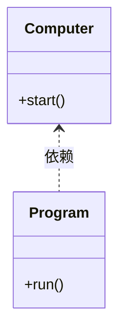
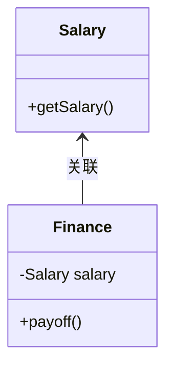
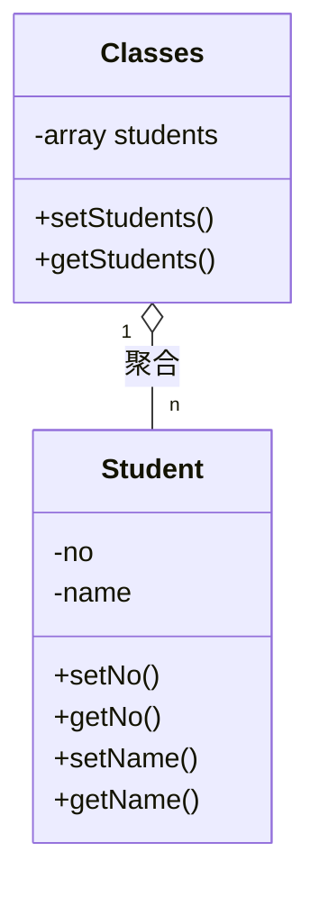
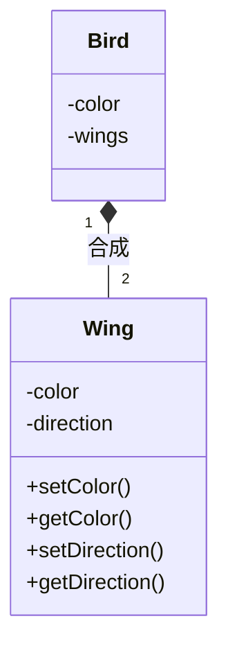
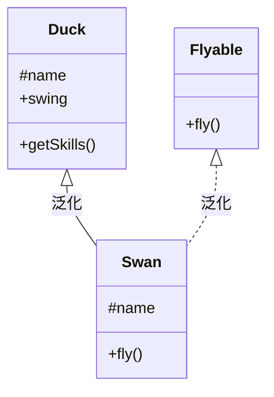

[toc]

# 一、算法


# 二、数据结构


# 三、设计模式

## 3.1 面向对象

### ① 面向过程

早期计算机编程面对的都是相对简单的问题，设计一个算法就可以解决，所以采用的是基于面向过程的方式

面向过程就是先分析出解决问题所需要的步骤，然后用函数把这些步骤一步一步实现，使用的时候一个一个依次调用就可以了

面向过程是自上而下的设计语言，先定好框架，再增砖添瓦，即先定好main()函数，然后再逐步实现main()函数中所要用到的其他方法

### ② 面向对象

随着计算机技术的不断提高，计算机被用于解决越来越复杂的问题，即产生了面向对象，一切事物皆对象，通过面向对象的方式，将现实世界的事物抽象成对象，现实世界中的关系抽象成类，继承，帮助人们实现对现实世界的抽象和数字建模，通过面向对象的方法，更利于用人理解的方式对复杂系统进行分析，设计与编程。同时，面向对象能有效提高编程效率，通过封装技术，消息机制可以像搭积木一样快速开发出一个全新的系统

面向对象是把构成问题事物分解成各个对象，建立对象的目的不是为了完成一个步骤，而是为了描述某个事物在整个解决问题的步骤中的行为

面向对象就是把现实中的事物都抽象成程序设计中的对象，其基本思想是一切皆对象，是一种自下而上的设计语言，先设计组件，再完成拼装

### ③ 面向对象VS面向过程

| 目录 | 面向对象                                                     | 面向过程                                                     |
| ---- | ------------------------------------------------------------ | ------------------------------------------------------------ |
| 特点 | 封装+继承+多态                                               | 数据结构+算法                                                |
| 优势 | 适用于大型复杂系统，方便复用                                 | 适用于简单系统，容易理解                                     |
| 劣势 | 比较抽象，因为类调用时，需要实例化，开销比较大，所以性能比面向过程低 | 难以应对复杂系统，难以复用，维护和扩展                       |
| 对比 | 易维护，复用，扩展，由于面向对象由封装，继承，多态等特性，可以设计出低耦合，更灵活，易维护的系统 | 性能比面向对象高，因为类调用时需要实例化，开销较大，比较消耗资源，比如单片机，嵌入式开发，Linux/Unix等一般采用面向过程开发，性能是最重要的因素 |

### ④ 对象

一切事物皆对象，对象是一个自包含的实体，用一组可识别的属性和行为来标识

### ⑤ 类

类就是具有相同的属性和行为的对象的抽象的集合

### ⑥ 面向对象三大特性--封装

每个对象都包含它能进行操作所需要的所有信息，这个特性称为封装，因此对象不必依赖其他对象来完成自己的操作

>封装的优点
>
>① 良好的封装能减少耦合
>
>② 类内部的实现可以自由地修改
>
>③ 类具有清晰的对外接口

### ⑦ 面向对象三大特性--继承

对象的继承代表了一种**is-a**的关系，如果两个对象A和B，可以描述为B是A，则表明B可以继承A，继承定义了类如何相互关联，共享特性

继承的工作方式是，定义父类（基类）和子类（派生类），其中子类不但继承了父类的所有特性，还可以定义新的特性

如果子类继承父类，第一、子类拥有父类非private属性和方法；第二、子类具有自己的属性和方法，即子类可以扩展父类没有的属性和方法；第三，子类还可以重写父类的属性和方法

>继承的优点
>
>① 继承使得子类公共的部分都放在了父类，使得代码得到了共享，避免了重复（代码越多，修改时出错的可能就越大）
>
>② 继承可使得修改或扩展都更加方便
>
>继承的缺点
>
>① 使得类间耦合更高（父类变，子类不得不变）
>
>② 继承会破坏封装性（父类实现细节暴漏给子类）

### ⑧ 面向对象三大特性--多态

多态表示不同的对象可以执行相同的动作，但要通过它们自己的实现代码来执行

多态的工作方式是，第一、子类以父类的身份出现；第二、子类在工作时以自己的方式来实现；第三、子类以父类的身份出现时，子类特有的属性和方法不可以使用

多态的原理是当方法被调用时，无论对象是否被转换为其父类，都只有位于对象继承链最末端的方法会被调用

### ⑨ 抽象类

类被声明为**abstract**为抽象类，方法被声明为**abstract**为抽象方法

第一、抽象类不能被实例化；第二、抽象方法必须被子类重写；第三、包含抽象方法的类必须是抽象类

抽象类通常代表一个抽象概念，它提供一个继承的出发点，当设计一个新的抽象类时，一定是用来继承的，抽象类应尽可能拥有多的共同代码，拥有尽可能少的数据

### ⑩ 接口

接口用**interface**声明

接口是把隐式公共方法和属性组合起来，以封装**特定**功能的一个集合。一旦类实现了接口，类就可以支持接口所指定的所有属性和成员。

第一、接口中的所有方法均是抽象方法；第二、实现接口的类必须实现接口中的所有属性和方法；第三、一个类可以实现多个接口,一个接口可以继承多个接口

> 标记接口
>
> 标记接口是没有任何方法和属性的接口，它仅仅表明它的类属于属于一个特定的类型，供其他代码来测试允许做一些事情，比较常用
>
> 标记接口的作用：简单来说就是给对象打个标签，使对象拥有某个或某些特权
>
> 标记接口主要用于两种目的
>
> ① 建立一个公共的父接口，可以使用标记接口来建立一组接口的父接口，使得接口可以归类（如A类接口用来做A事，B类接口做B事，一目了然）
>
> ② 向一个类添加数据类型，这种是标记接口最初的目的，实现标记接口的类不需要实现任何方法，但是该类通过多态变成一个接口类型

### ⑪ 抽象类和接口的区别

>① 抽象可以给出一些成员的实现，接口却不能包含成员实现
>
>② 抽象类的成员可被子类部分实现，接口的成员需要实现类全部实现
>
>③ 一个类只能继承一个抽象类，但可以实现多个接口
>
>④ 抽象类只能单继承，接口可以多继承
>
>**⑤** 类是对对象的抽象，抽象类是对类的抽象，接口是对行为的抽象（接口是对类的局部（行为）进行的抽象，而抽象类是对类整体（字段，属性，方法）的抽象，如果只关注行为的抽象，也可以认为接口就是抽象类，总之，不论是接口，抽象类，类甚至对象，都是在不同层次，不同角度进行抽象的结果，它们的共性就是抽象）
>
>**⑥** 如果行为跨越不同类的对象，可以使用接口；对于一些相似的类的对象，用继承抽象类
>
>**⑦** 从设计角度讲，抽象类是从子类中发现了公共的东西，泛化出父类，然后子类继承父类；而接口是根本不知子类的存在，方法如何实现还不确定，预先定义


## 3.2 类之间的关系

> 类之间的关系可以用UML表示，如[PlantUML](https://plantuml.com/zh/class-diagram)
>
> 面向对象设计类之间的关系主要由五种，耦合（当一个类发生改变，对其他类造成的影响程度）从低到高依次为：依赖 < 关联 < 聚合 < 组合 < 泛化
>
> 在描述类之间的关系时，总觉得绕口，技巧：令箭头指向的类在后，**非箭头指向类|类关系|箭头指向类**，如下面的example，如项目依赖电脑，财务关联工资单
>
> 翅膀合成鸟（鸟有两个翅膀），需要在类的两端画出基数（数字），表明这端的类可以有几个实例，无数个实例基数为n

### ① 依赖（Dependency）

理解：类A要完成某个功能引用了类B,则类A依赖类B，这里的引用除了：类B的实例等不能作为类A的属性

代码表现：类A依赖类B时，类A的某个成员函数的返回值，形参，局部变量引用了类B或者类A调用了类B的静态方法

UML表示：虚线+箭头

example：项目运行，需要有一台启动的电脑（项目依赖电脑）



~~~php
<?php

declare(strict_types=1);

class Computer
{
    public static function start()
    {
        echo '电脑启动成功<br>';
    }
}

class Program
{
    public function run()
    {
        Computer::start();
        echo '项目运行成功';
    }
}

$program = new Program();
$program->run();
~~~


### ② 关联（Association）

理解：类A知道类B，可以用关联，具体表现为：类B作为类A的一个属性，而属性是一种更紧密的耦合，更为长久的持有关系

代码表现：类A关联类B时，类B的引用作为类A的一个成员属性

UML表示：实线+箭头

example：财务发工资需要知道工资单（财务关联工资单）



```php
<?php

declare(strict_types=1);

class Salary
{
    private string $name;
    private float $salary = 3000;
    private float $sales;
    private array $employees = [
        ['name' => '张一', 'type' => '开发'],
        ['name' => '张二', 'type' => '业务员'],
        ['name' => '张三', 'type' => '行政']
    ];

    public function __construct(string $name, float $sales = 0)
    {
        $this->name = $name;
        $this->sales = $sales;
    }

    /**
     * 获取工资
     *
     * 开发和行政正常工资，业务员正常工资+销售额*5%
     *
     * @return float
     */
    public function getSalary(): float
    {
        $type = '';
        $salary = 0;

        foreach ($this->employees as $item) {
            if ($item['name'] === $this->name) {
                $type = $item['type'];
            }
        }

        if ($type === '业务员') {
            $salary = $this->salary + ($this->sales * 0.05);
        } elseif ($type !== '') {
            $salary = $this->salary;
        }

        return $salary;
    }
}

class Finance
{
    private ?Salary $salary = null;

    /**
     * 工资支付
     *
     * @param string $name
     * @param float $sales
     */
    public function payOff(string $name, float $sales = 0)
    {
        $this->salary = new Salary($name, $sales);
        echo sprintf('支付%s工资：%04.2f元', $name, $this->salary->getSalary());
    }
}

$finance = new Finance();
$finance->payOff('张二', 10000);
```


### ③ 聚合（Aggregation）

理解：聚合用来表示集体与个体之间的关联关系，它表示一种弱的拥有关系，表示A对象可以包含B对象，但是B对象不是A对象的一部分

代码表现：若A聚合B，则B类中包含一个值为A类对象集的成员属性

UML表示：实线+空心菱形

example：班级可以有（包含）多个学生（学生聚合班级）



```php
<?php

declare(strict_types=1);

class Student
{
    private int $no;
    private string $name;

    /**
     * @return int
     */
    public function getNo(): int
    {
        return $this->no;
    }

    /**
     * @param int $no
     */
    public function setNo(int $no): void
    {
        $this->no = $no;
    }

    /**
     * @return string
     */
    public function getName(): string
    {
        return $this->name;
    }

    /**
     * @param string $name
     */
    public function setName(string $name): void
    {
        $this->name = $name;
    }
}

class Classes
{
    private array $students = [];

    public function setStudents(Student $student)
    {
        $this->students[] = $student;
    }

    public function getStudents(): array
    {
        return $this->students;
    }
}

$classes = new Classes();

$stu1 = new Student();
$stu1->setNo(1);
$stu1->setName('张三');
$classes->setStudents($stu1);

$stu2 = clone $stu1;
$stu2->setNo(2);
$stu2->setName('李四');
$classes->setStudents($stu2);

var_dump($classes->getStudents());
```


### ④ 合成（Composition）

理解：合成（组合）用来表示个体与组成部分之间的关联关系，它表示一种强的拥有关系，体现了严格的部分和整体的关系，部分和整体的生命周期一样

代码表现：若A合成B，则B类包含一个A类引用的成员属性，且B类初始化的同时应初始化A类以保证其相同的生命周期

UML表示：实线+实心菱形

example：鸟有左右两个翅膀（翅膀合成鸟）



```php
<?php

declare(strict_types=1);

class Bird
{
    private string $color;
    private array $wings;

    public function __construct(string $color)
    {
        $leftWing = new Wing();
        $leftWing->setColor($color);
        $leftWing->setDirection('left');
        $rightWing = clone $leftWing;
        $rightWing->setDirection('right');

        $this->color = $color;
        $this->wings = [$leftWing, $rightWing];
    }
}

class Wing
{
    private string $color;
    private string $direction;

    /**
     * @return string
     */
    public function getColor(): string
    {
        return $this->color;
    }

    /**
     * @param string $color
     */
    public function setColor(string $color): void
    {
        $this->color = $color;
    }

    /**
     * @return string
     */
    public function getDirection(): string
    {
        return $this->direction;
    }

    /**
     * @param string $direction
     */
    public function setDirection(string $direction): void
    {
        $this->direction = $direction;
    }
}

$bird = new Bird('black');
var_dump($bird);
```


### ⑤ 泛化（Generalization）

理解：泛化指的是类与类之间的继承关系和类与接口之间的实现关系，依赖、关联、聚合、组合是逻辑上的关联，泛化是物理上的关联，所以耦合最强

代码表现：A泛化B，则类A继承了类B或者类A实现了B接口

UML表示：类间继承，实线+空心三角形；类实现接口，虚线+空心三角形

example：白天鹅继承丑小鸭后会飞（白天鹅泛化丑小鸭类，白天鹅泛化飞行接口）




```php
<?php

declare(strict_types=1);

interface Flyable
{
    public function fly();
}

class Duck
{
    protected string $name = '丑小鸭';

    public function swing()
    {
        echo $this->name . 'can swing';
    }

    /**
     * 利用反射获取技能
     */
    public function getSkills()
    {
        $skills = null;
        $reflect = new ReflectionClass($this);
        $methods = $reflect->getMethods();

        foreach ($methods as $method) {
            if ($method->name !== 'getSkills') {
                $skills[] = $method->name;
            }
        }

        echo sprintf('%s技能有：%s', $this->name, implode(',', $skills)) . '<br>';
    }
}

class Swan extends Duck implements Flyable
{
    protected string $name = '白天鹅';

    public function fly()
    {
        echo $this->name . 'can fly';
    }
}

$duck = new Duck();
$duck->getSkills();

$swan = new Swan();
$swan->getSkills();
```


## 3.3 面向对象设计原则

### ① 单一职责

一个类只负责一个功能领域中的相应职责，或者可以定义为：就一个类而言，应该只有一个引起它变化的原因

单一职责原则是实现高内聚、低耦合的指导方针

### ② 开闭

一个软件实体应当对扩展开放，对修改关闭，即软件实体应尽量在不修改原有代码的情况下进行扩展

抽象化是开闭原则的关键，可以为系统定义相对稳定的抽象层，将不同的实现转移到具体的实现层中完成，这样当需要改动系统，无需改动抽象层，只需要增加新的具体类来实现新的需求

### ③ 里氏替换

所有引用基类的地方必须能透明地使用其子类对象，反之不成立

里氏替换原则是对开闭原则的补充，也是实现开闭原则的重要方式之一，由于使用基类对象的地方都可以使用子类对象，因此在程序中应尽量使用基类类型来定义对象，而在运行时再确定其子类类型，用子类对象替代基类对象

重点：为了确保该原则的应用，一个具体类应当只实现接口或抽象类中声明过的方法，而不要给出多余的方法，否则无法调用到在子类中新增的方法

### ④ 依赖倒转

抽象不应该依赖于细节，细节应该依赖于抽象，即应针对接口编程，而不是针对实现编程

开闭原则是目标，里氏替换是基础，依赖倒转是手段，三者一般同时出现，它们相辅相成，互相补充，目标一致

依赖倒转原则要求在我们的程序中，尽量引用层次更高的抽象层，而不是具体实现层

重点：为了确保该原则的应用，一个具体类应当只实现接口或抽象类中声明过的方法，而不要给出多余的方法，否则无法调用到在子类中新增的方法

### ⑤ 接口隔离

尽可能使用多个专门的接口，避免使用单一的总接口，即客户端不应该依赖于那些它不需要的接口

不要在一个接口里面放很多方法，这样类会很臃肿，接口应尽量细化，一个接口对应一个功能模块，同时接口里面的方法应尽可能少，使接口更加轻便灵活

### ⑥ 迪米特

### ⑦ 合成复用


## 3.4 设计模式分类

### 3.4.1 创建型设计模式

#### ① 简单工厂

#### ② 工厂方法

#### ③ 抽象工厂

#### ④ 单例

#### ⑤ 原型

#### ⑥ 对象池

#### ⑦ 建造者

### 3.4.2 结构型设计模式

#### ① 适配器

#### ② 桥接

#### ③ 过滤器

#### ④ 组合

#### ⑤ 装饰器

#### ⑥ 外观

#### ⑦ 享元

#### ⑧ 代理

### 3.4.3 行为型设计模式

#### ① 策略

#### ② 空对象

#### ③ 访问者

#### ④ 状态

#### ⑤ 责任链

#### ⑥ 中介者

#### ⑦ 备忘录

#### ⑧ 观察者

#### ⑨ 命令

#### ⑩ 解释器

#### ⑪ 迭代器

#### ⑫ 解释器


# 四、操作系统


# 五、计算机网络


# 六、Leetcode


# 七、Linux


# 八、MySQL


# 九、NoSQL


# 十、PHP


#  十一、Nginx


# 十二、消息队列


# 十三、ES


# 十四、Docker


