- [一、算法](#一算法)
- [二、数据结构](#二数据结构)
- [三、设计模式](#三设计模式)
  - [3.1 面向对象](#31-面向对象)
    - [① 面向过程](#-面向过程)
    - [② 面向对象](#-面向对象)
    - [③ 面向对象VS面向过程](#-面向对象vs面向过程)
    - [④ 对象](#-对象)
    - [⑤ 类](#-类)
    - [⑥ 面向对象三大特性--封装](#-面向对象三大特性--封装)
    - [⑦ 面向对象三大特性--继承](#-面向对象三大特性--继承)
    - [⑧ 面向对象三大特性--多态](#-面向对象三大特性--多态)
    - [⑨ 抽象类](#-抽象类)
    - [⑩ 接口](#-接口)
    - [⑪ 抽象类和接口的区别](#-抽象类和接口的区别)
    - [⑫ 面向组件](#-面向组件)
    - [⑬ 面向对象VS面向组件](#-面向对象vs面向组件)
  - [3.2 类之间的关系](#32-类之间的关系)
    - [① 依赖（Dependency）](#-依赖dependency)
      - [理解](#理解)
      - [代码表现](#代码表现)
      - [UML表示](#uml表示)
      - [案例](#案例)
    - [② 关联（Association）](#-关联association)
      - [理解](#理解-1)
      - [代码表现](#代码表现-1)
      - [UML表示](#uml表示-1)
      - [案例](#案例-1)
    - [③ 聚合（Aggregation）](#-聚合aggregation)
      - [理解](#理解-2)
      - [代码表现](#代码表现-2)
      - [UML表示](#uml表示-2)
      - [案例](#案例-2)
    - [④ 合成（Composition）](#-合成composition)
      - [理解](#理解-3)
      - [代码表现](#代码表现-3)
      - [UML表示](#uml表示-3)
      - [案例](#案例-3)
    - [⑤ 泛化（Generalization）](#-泛化generalization)
      - [理解](#理解-4)
      - [代码表现](#代码表现-4)
      - [UML表示](#uml表示-4)
      - [案例](#案例-4)
  - [3.3 面向对象设计原则](#33-面向对象设计原则)
    - [① 开闭](#-开闭)
      - [定义](#定义)
      - [案例](#案例-5)
      - [优点](#优点)
      - [概述](#概述)
      - [最佳实践](#最佳实践)
    - [② 单一职责](#-单一职责)
      - [定义](#定义-1)
      - [案例](#案例-6)
      - [优点](#优点-1)
      - [概述](#概述-1)
      - [最佳实践](#最佳实践-1)
    - [③ 里氏替换](#-里氏替换)
      - [定义](#定义-2)
      - [案例](#案例-7)
      - [优点](#优点-2)
      - [概述](#概述-2)
      - [最佳实践](#最佳实践-2)
    - [④ 依赖倒转](#-依赖倒转)
      - [定义](#定义-3)
      - [案例](#案例-8)
      - [优点](#优点-3)
      - [概述](#概述-3)
      - [最佳实践](#最佳实践-3)
    - [⑤ 接口隔离](#-接口隔离)
      - [定义](#定义-4)
      - [案例](#案例-9)
      - [优点](#优点-4)
      - [概述](#概述-4)
      - [最佳实践](#最佳实践-4)
    - [⑥ 迪米特](#-迪米特)
      - [定义](#定义-5)
      - [案例](#案例-10)
      - [优点](#优点-5)
      - [概述](#概述-5)
      - [最佳实践](#最佳实践-5)
    - [⑦ 合成复用](#-合成复用)
      - [定义](#定义-6)
      - [案例](#案例-11)
      - [优点](#优点-6)
      - [概述](#概述-6)
      - [最佳实践](#最佳实践-6)
  - [3.4 设计模式分类](#34-设计模式分类)
    - [3.4.1 创建型设计模式](#341-创建型设计模式)
      - [① 简单工厂](#-简单工厂)
      - [② 工厂方法](#-工厂方法)
      - [③ 抽象工厂](#-抽象工厂)
      - [④ 单例](#-单例)
      - [⑤ 原型](#-原型)
      - [⑥ 对象池](#-对象池)
      - [⑦ 建造者](#-建造者)
    - [3.4.2 结构型设计模式](#342-结构型设计模式)
      - [① 适配器](#-适配器)
      - [② 桥接](#-桥接)
      - [③ 过滤器](#-过滤器)
      - [④ 组合](#-组合)
      - [⑤ 装饰器](#-装饰器)
      - [⑥ 外观](#-外观)
      - [⑦ 享元](#-享元)
      - [⑧ 代理](#-代理)
    - [3.4.3 行为型设计模式](#343-行为型设计模式)
      - [① 策略](#-策略)
      - [② 空对象](#-空对象)
      - [③ 访问者](#-访问者)
      - [④ 状态](#-状态)
      - [⑤ 责任链](#-责任链)
      - [⑥ 中介者](#-中介者)
      - [⑦ 备忘录](#-备忘录)
      - [⑧ 观察者](#-观察者)
      - [⑨ 命令](#-命令)
      - [⑩ 解释器](#-解释器)
      - [⑪ 迭代器](#-迭代器)
      - [⑫ 解释器](#-解释器-1)
- [四、操作系统](#四操作系统)
- [五、计算机网络](#五计算机网络)
- [六、Leetcode](#六leetcode)
- [七、Linux](#七linux)
- [八、MySQL](#八mysql)
- [九、NoSQL](#九nosql)
- [十、PHP](#十php)
- [十一、Nginx](#十一nginx)
- [十二、消息队列](#十二消息队列)
- [十三、ES](#十三es)
- [十四、Docker](#十四docker)

# 一、算法


# 二、数据结构


# 三、设计模式

## 3.1 面向对象

### ① 面向过程

早期计算机编程面对的都是相对简单的问题，设计一个算法就可以解决，所以采用的是基于面向过程的方式

面向过程就是先分析出解决问题所需要的步骤，然后用函数把这些步骤一步一步实现，使用的时候一个一个依次调用就可以了

面向过程是自上而下的设计语言，先定好框架，再增砖添瓦，即先定好main()函数，然后再逐步实现main()函数中所要用到的其他方法

### ② 面向对象

随着计算机技术的不断提高，计算机被用于解决越来越复杂的问题，即产生了面向对象，一切事物皆对象，通过面向对象的方式，将现实世界的事物抽象成对象，现实世界中的关系抽象成类，继承，帮助人们实现对现实世界的抽象和数字建模，通过面向对象的方法，更利于用人理解的方式对复杂系统进行分析，设计与编程。同时，面向对象能有效提高编程效率，通过封装技术，消息机制可以像搭积木一样快速开发出一个全新的系统

面向对象是把构成问题事物分解成各个对象，建立对象的目的不是为了完成一个步骤，而是为了描述某个事物在整个解决问题的步骤中的行为

面向对象就是把现实中的事物都抽象成程序设计中的对象，其基本思想是一切皆对象，是一种自下而上的设计语言，先设计组件，再完成拼装

### ③ 面向对象VS面向过程

| 目录 | 面向对象                                                     | 面向过程                                                     |
| ---- | ------------------------------------------------------------ | ------------------------------------------------------------ |
| 特点 | 封装+继承+多态                                               | 数据结构+算法                                                |
| 优势 | 适用于大型复杂系统，方便复用                                 | 适用于简单系统，容易理解                                     |
| 劣势 | 比较抽象，因为类调用时，需要实例化，开销比较大，所以性能比面向过程低 | 难以应对复杂系统，难以复用，维护和扩展                       |
| 对比 | 易维护，复用，扩展，由于面向对象由封装，继承，多态等特性，可以设计出低耦合，更灵活，易维护的系统 | 性能比面向对象高，因为类调用时需要实例化，开销较大，比较消耗资源，比如单片机，嵌入式开发，Linux/Unix等一般采用面向过程开发，性能是最重要的因素 |

### ④ 对象

一切事物皆对象，对象是一个自包含的实体，用一组可识别的属性和行为来标识

### ⑤ 类

类就是具有相同的属性和行为的对象的抽象的集合

### ⑥ 面向对象三大特性--封装

每个对象都包含它能进行操作所需要的所有信息，这个特性称为封装，因此对象不必依赖其他对象来完成自己的操作

>封装的优点
>
>① 良好的封装能减少耦合
>
>② 类内部的实现可以自由地修改
>
>③ 类具有清晰的对外接口

### ⑦ 面向对象三大特性--继承

对象的继承代表了一种**is-a**的关系，如果两个对象A和B，可以描述为B是A，则表明B可以继承A，继承定义了类如何相互关联，共享特性

继承的工作方式是，定义父类（基类）和子类（派生类），其中子类不但继承了父类的所有特性，还可以定义新的特性

如果子类继承父类，第一、子类拥有父类非private属性和方法；第二、子类具有自己的属性和方法，即子类可以扩展父类没有的属性和方法；第三，子类还可以重写父类的属性和方法

>继承的优点
>
>① 继承使得子类公共的部分都放在了父类，使得代码得到了共享，避免了重复（代码越多，修改时出错的可能就越大）
>
>② 继承可使得修改或扩展都更加方便
>
>继承的缺点
>
>① 使得类间耦合更高（父类变，子类不得不变）
>
>② 继承会破坏封装性（父类实现细节暴漏给子类）

### ⑧ 面向对象三大特性--多态

多态表示不同的对象可以执行相同的动作，但要通过它们自己的实现代码来执行

多态的工作方式是，第一、子类以父类的身份出现；第二、子类在工作时以自己的方式来实现；第三、子类以父类的身份出现时，子类特有的属性和方法不可以使用

多态的原理是当方法被调用时，无论对象是否被转换为其父类，都只有位于对象继承链最末端的方法会被调用

### ⑨ 抽象类

类被声明为**abstract**为抽象类，方法被声明为**abstract**为抽象方法

第一、抽象类不能被实例化；第二、抽象方法必须被子类重写；第三、包含抽象方法的类必须是抽象类

抽象类通常代表一个抽象概念，它提供一个继承的出发点，当设计一个新的抽象类时，一定是用来继承的，抽象类应尽可能拥有多的共同代码，拥有尽可能少的数据

### ⑩ 接口

接口用**interface**声明

接口是把隐式公共方法和属性组合起来，以封装**特定**功能的一个集合。一旦类实现了接口，类就可以支持接口所指定的所有属性和成员。

第一、接口中的所有方法均是抽象方法；第二、实现接口的类必须实现接口中的所有属性和方法；第三、一个类可以实现多个接口,一个接口可以继承多个接口

> 标记接口
>
> 标记接口是没有任何方法和属性的接口，它仅仅表明它的类属于属于一个特定的类型，供其他代码来测试允许做一些事情，比较常用
>
> 标记接口的作用：简单来说就是给对象打个标签，使对象拥有某个或某些特权
>
> 标记接口主要用于两种目的
>
> ① 建立一个公共的父接口，可以使用标记接口来建立一组接口的父接口，使得接口可以归类（如A类接口用来做A事，B类接口做B事，一目了然）
>
> ② 向一个类添加数据类型，这种是标记接口最初的目的，实现标记接口的类不需要实现任何方法，但是该类通过多态变成一个接口类型

### ⑪ 抽象类和接口的区别

>① 抽象可以给出一些成员的实现，接口却不能包含成员实现
>
>② 抽象类的成员可被子类部分实现，接口的成员需要实现类全部实现
>
>③ 一个类只能继承一个抽象类，但可以实现多个接口
>
>④ 抽象类只能单继承，接口可以多继承
>
>**⑤** 类是对对象的抽象，抽象类是对类的抽象，接口是对行为的抽象（接口是对类的局部（行为）进行的抽象，而抽象类是对类整体（字段，属性，方法）的抽象，如果只关注行为的抽象，也可以认为接口就是抽象类，总之，不论是接口，抽象类，类甚至对象，都是在不同层次，不同角度进行抽象的结果，它们的共性就是抽象）
>
>**⑥** 如果行为跨越不同类的对象，可以使用接口；对于一些相似的类的对象，用继承抽象类
>
>**⑦** 从设计角度讲，抽象类是从子类中发现了公共的东西，泛化出父类，然后子类继承父类；而接口是根本不知子类的存在，方法如何实现还不确定，预先定义

### ⑫ 面向组件

todo

### ⑬ 面向对象VS面向组件

todo

## 3.2 类之间的关系

> 类之间的关系可以用UML表示，如[PlantUML](https://plantuml.com/zh/class-diagram)
>
> 面向对象设计类之间的关系主要由五种，耦合（当一个类发生改变，对其他类造成的影响程度）从低到高依次为：依赖 < 关联 < 聚合 < 组合 < 泛化
>
> 在描述类之间的关系时，总觉得绕口，技巧：令箭头指向的类在后，**非箭头指向类|类关系|箭头指向类**，如下面的example，如项目依赖电脑，财务关联工资单
>
> 翅膀合成鸟（鸟有两个翅膀），需要在类的两端画出基数（数字），表明这端的类可以有几个实例，无数个实例基数为n

### ① 依赖（Dependency）

#### 理解

类A要完成某个功能引用了类B,则类A依赖类B，这里的引用除了：类B的实例等不能作为类A的属性

#### 代码表现

类A依赖类B时，类A的某个成员函数的返回值，形参，局部变量引用了类B或者类A调用了类B的静态方法

#### UML表示

虚线+箭头

#### 案例

项目运行，需要有一台启动的电脑（项目依赖电脑）

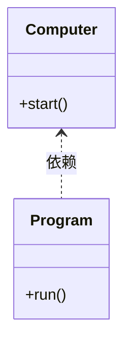

```php
<?php

declare(strict_types=1);

class Computer
{
    public static function start()
    {
        echo '电脑启动成功<br>';
    }
}

class Program
{
    public function run()
    {
        Computer::start();
        echo '项目运行成功';
    }
}

$program = new Program();
$program->run();
```

### ② 关联（Association）

#### 理解

类A知道类B，可以用关联，具体表现为：类B作为类A的一个属性，而属性是一种更紧密的耦合，更为长久的持有关系

#### 代码表现

类A关联类B时，类B的引用作为类A的一个成员属性

#### UML表示

实线+箭头

#### 案例

财务发工资需要知道工资单（财务关联工资单）

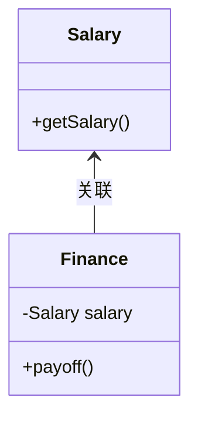

```php
<?php

declare(strict_types=1);

class Salary
{
    private string $name;
    private float $salary = 3000;
    private float $sales;
    private array $employees = [
        ['name' => '张一', 'type' => '开发'],
        ['name' => '张二', 'type' => '业务员'],
        ['name' => '张三', 'type' => '行政']
    ];

    public function __construct(string $name, float $sales = 0)
    {
        $this->name = $name;
        $this->sales = $sales;
    }

    /**
     * 获取工资
     *
     * 开发和行政正常工资，业务员正常工资+销售额*5%
     *
     * @return float
     */
    public function getSalary(): float
    {
        $type = '';
        $salary = 0;

        foreach ($this->employees as $item) {
            if ($item['name'] === $this->name) {
                $type = $item['type'];
            }
        }

        if ($type === '业务员') {
            $salary = $this->salary + ($this->sales * 0.05);
        } elseif ($type !== '') {
            $salary = $this->salary;
        }

        return $salary;
    }
}

class Finance
{
    private ?Salary $salary = null;

    /**
     * 工资支付
     *
     * @param string $name
     * @param float $sales
     */
    public function payOff(string $name, float $sales = 0)
    {
        $this->salary = new Salary($name, $sales);
        echo sprintf('支付%s工资：%04.2f元', $name, $this->salary->getSalary());
    }
}

$finance = new Finance();
$finance->payOff('张二', 10000);
```

### ③ 聚合（Aggregation）

#### 理解

聚合用来表示集体与个体之间的关联关系，它表示一种弱的拥有关系，表示A对象可以包含B对象，但是B对象不是A对象的一部分

#### 代码表现

若A聚合B，则B类中包含一个值为A类引用的成员属性

聚合和关联在在代码表现上一致，需要从语义上进行分析，关联表示一个类知道另一个类，聚合表示集体与个体之间的关联关系

> 从大话数据结构中看到聚合的例子是大雁和雁群，即雁群中包含一个大雁的对象集成员属性，但是结合网上的一些解释和合成复用原则，我认为应该是从上下文语义上进行区别，比如财务和关联工资单，从语义上不能说是工资单聚合财务吧，他们不是集体与个体的关系，学生聚合班级，从上下文语言上怎么都是学生聚合班级比班级知道（关联）学生更合适

#### UML表示

实线+空心菱形

#### 案例

班级可以有（包含）多个学生（学生聚合班级）

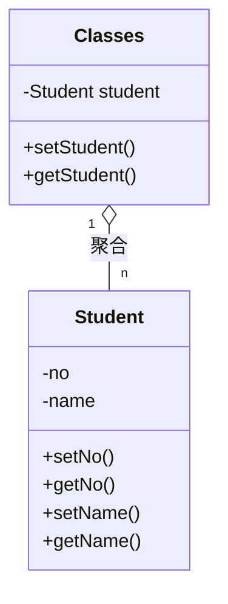

```php
<?php

declare(strict_types=1);

class Student
{
    private int $no;
    private string $name;

    /**
     * @return int
     */
    public function getNo(): int
    {
        return $this->no;
    }

    /**
     * @param int $no
     */
    public function setNo(int $no): void
    {
        $this->no = $no;
    }

    /**
     * @return string
     */
    public function getName(): string
    {
        return $this->name;
    }

    /**
     * @param string $name
     */
    public function setName(string $name): void
    {
        $this->name = $name;
    }
}

class Classes
{
    private Student $student;

    public function setStudent(Student $student)
    {
        $this->student = $student;
    }

    public function getStudent(): Student
    {
        return $this->student;
    }
}

$classes = new Classes();

$stu1 = new Student();
$stu1->setNo(1);
$stu1->setName('张三');
$classes->setStudent($stu1);

var_dump($classes->getStudent());
```

### ④ 合成（Composition）

#### 理解

合成（组合）用来表示个体与组成部分之间的关联关系，它表示一种强的拥有关系，体现了严格的部分和整体的关系，部分和整体的生命周期一样

#### 代码表现

若A合成B，则B类包含一个A类引用的成员属性，且B类初始化的同时应初始化A类以保证其相同的生命周期

#### UML表示

实线+实心菱形

#### 案例

鸟有左右两个翅膀（翅膀合成鸟）

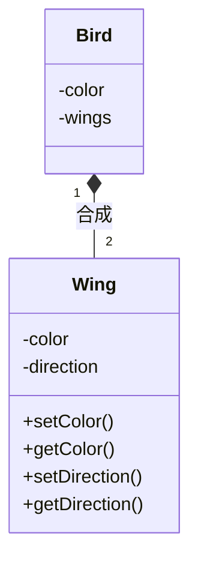

```php
<?php

declare(strict_types=1);

class Bird
{
    private string $color;
    private array $wings;

    public function __construct(string $color)
    {
        $leftWing = new Wing();
        $leftWing->setColor($color);
        $leftWing->setDirection('left');
        $rightWing = clone $leftWing;
        $rightWing->setDirection('right');

        $this->color = $color;
        $this->wings = [$leftWing, $rightWing];
    }
}

class Wing
{
    private string $color;
    private string $direction;

    /**
     * @return string
     */
    public function getColor(): string
    {
        return $this->color;
    }

    /**
     * @param string $color
     */
    public function setColor(string $color): void
    {
        $this->color = $color;
    }

    /**
     * @return string
     */
    public function getDirection(): string
    {
        return $this->direction;
    }

    /**
     * @param string $direction
     */
    public function setDirection(string $direction): void
    {
        $this->direction = $direction;
    }
}

$bird = new Bird('black');
var_dump($bird);
```

### ⑤ 泛化（Generalization）

#### 理解

泛化指的是类与类之间的继承关系和类与接口之间的实现关系，依赖、关联、聚合、组合是逻辑上的关联，泛化是物理上的关联，所以耦合最强

#### 代码表现

A泛化B，则类A继承了类B或者类A实现了B接口

#### UML表示

类间继承，实线+空心三角形；类实现接口，虚线+空心三角形

#### 案例

白天鹅继承丑小鸭后会飞（白天鹅泛化丑小鸭类，白天鹅泛化飞行接口）

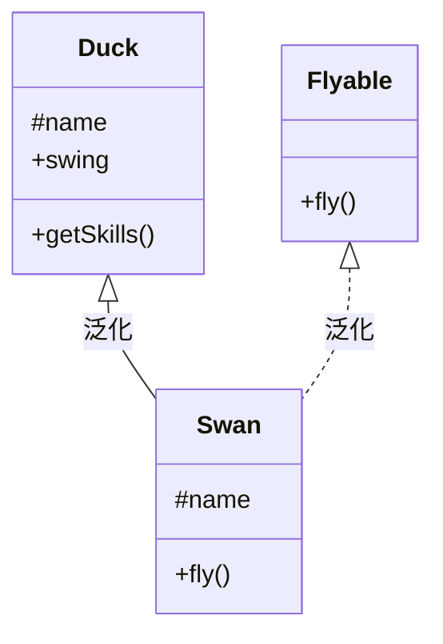

```php
<?php

declare(strict_types=1);

interface Flyable
{
    public function fly();
}

class Duck
{
    protected string $name = '丑小鸭';

    public function swing()
    {
        echo $this->name . 'can swing';
    }

    /**
     * 利用反射获取技能
     */
    public function getSkills()
    {
        $skills = null;
        $reflect = new ReflectionClass($this);
        $methods = $reflect->getMethods();

        foreach ($methods as $method) {
            if ($method->name !== 'getSkills') {
                $skills[] = $method->name;
            }
        }

        echo sprintf('%s技能有：%s', $this->name, implode(',', $skills)) . '<br>';
    }
}

class Swan extends Duck implements Flyable
{
    protected string $name = '白天鹅';

    public function fly()
    {
        echo $this->name . 'can fly';
    }
}

$duck = new Duck();
$duck->getSkills();

$swan = new Swan();
$swan->getSkills();
```

## 3.3 面向对象设计原则

### ① 开闭

#### 定义

**Open Close Principle[OCP]**

**软件实体（类、模块、函数等）应该可以扩展，但是不可修改**

>开闭原则对扩展开放，对修改关闭，并不意味着不做任何修改，低层模块的变更，必然要有高层模块进行耦合，否则就是一个孤立无意义的代码判断
>
>开闭原则是最基础的一个原则，其它设计原则都是对开闭原则的具体解释，是实现开闭原则的指导工具和方法

#### 案例

原来需求是实现两个数的加减

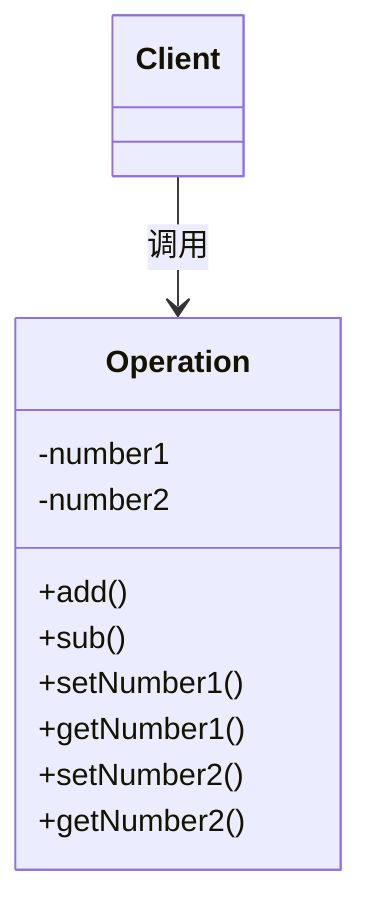

现在需要新增两个数的乘除，取余等

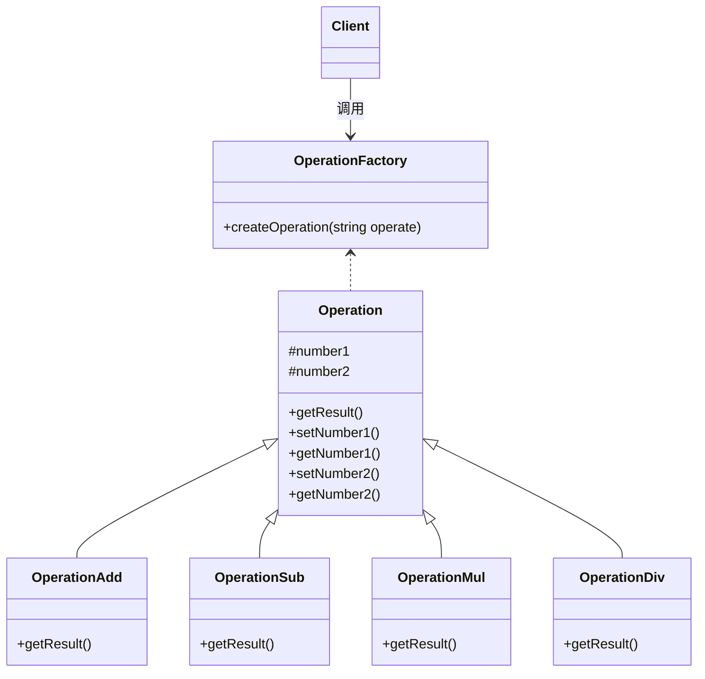

#### 优点

* 利于测试

  所有已经投产的代码都是有意义的，并且都受系统规则的约束，这样的代码都要经过千锤百炼的测试过程，不仅保证逻辑是正确的，还要保证苛刻条件（高压力，异常，错误）下不产生有毒代码，因此有变化提出时，我们就需要考虑一下，原有的健壮代码是否可以不修改，仅仅通过扩展实现变化呢？否则，就需要把原有的测试过程回笼一遍，需要进行单元测试，功能测试，继承测试甚至是验收测试，现在虽然在大力提倡自动化测试工具，但是仍然代替不了人工的测试工作

  **一个方法的测试方法一般不少于三种，首先是正常的业务逻辑要保证测试到，其次是边界条件要测试到，然后是异常要测试到**，比较重要的方法的测试方法甚至有十多种，而且单元测试是对类的测试，类中的方法是允许耦合的，在这样的条件下，如果再想着修改一个方法或多个方法代码来完成变化不太可能，这样该类所有的测试方法都要重构，还有，在实际项目中，一个类一般只有一个测试类，其中可以有很多测试方法，在一堆本来就很复杂的断言中进行大量修改，难免会出现遗漏

  所以，我们需要通过扩展来实现业务逻辑的变化，而不是修改，如扩展新增一个子类，我们同时新增一个子类的测试类即可，**单元测试是孤立测试，只要保证我提供的方法正确就成了，其它的我不管**

* 提高复用性

  在面向对象的设计中，所有的逻辑都是从原子逻辑组合而来的，而不是在一个类中独立实现一个业务逻辑。只有这样代码才可以复用，粒度越小，被复用的可能性就越大。为社么要复用呢？减少代码量，避免相同的逻辑分散在多个角落，避免日后的维护人员为了修改一个微小的缺陷或增加新功能而要在整个项目中到处查找相关代码。怎么才能提高复用率呢？缩小逻辑粒度，直到一个逻辑不可再分为止

* 提高可维护性

  一款软件投拆后，维护人员的工作不仅仅是对数据进行维护，还可能对程序进行扩展，维护人员最乐意做的事情是扩展一个类，而不是修改一个类，不管原有的代码写的多么优秀还是多么糟糕，让维护人员读懂原有的代码，然后再修改，是一件很痛苦的事情

  > 开闭原子是面向对象开发的要求，万物皆对象，我们需要把所有的事物都抽象成对象，然后针对对象进行操作，但是万物皆运动，有运动就有变化，有变化就有策略去应对，怎么快速应对呢？这就需要在设计之初考虑到所有可能变化的因素，然后留下接口，等待可能转变为现实

#### 概述

一个软件产品只要在生命周期内，都会发生变化，既然变化是一个既定的事实，我们就应该在设计时尽量适应这些变化，以提高项目的稳定性和灵活性，真正实现拥抱变化。开闭原则的含义是说一个软件实体应该通过扩展来实现变化，而不是通过修改已有的代码来实现变化。它是为软件实体的未来事件而制定的对现行开发设计进行约束的一个原则。

​	可以把变化归纳为三种类型：

* 逻辑变化

  只变化一个逻辑，而不涉及其它模块，比如原有一个算法是a*b+c，现在需要改为a+b+c，可以通过修改原有类中方法的方式来完成，前提条件是所有依赖或关联类都按照相同的逻辑处理

* 子模块变化

  一个模块变化，会对其它的模块产生影响，特别是一个低层次的模块变化必然引起高层模块的变化，因此在通过扩展完成变化时，高层模块修改是必然的

* 可见视图变化

  可见视图是提供给客户使用的界面，如JSP程序，Swing界面等，该部分的变化一般会引起连锁反应，如果仅仅是界面上按钮，文字重新排版倒是简单，最常见的是业务耦合变化，如一个展示数据的列表，按照原有的需求是6列，突然有一天要增加一列，而且这一列要跨N张表，处理M个逻辑才能展现出来，这样的变化是比较恐怖的，但还是可以通过扩展来完成变化，这就要看我们原有的设计是否灵活。一个项目的基本路径是这样的：项目开发，重构，测试，投产，运维，其中重构可以对原有的设计和代码进行修改，运维尽量减少对原有代码的修改，保持历史代码的纯洁性，提高系统的稳定性

  > 高层模块和低层模块：每一个逻辑的实现都是由原子逻辑组成的，不可分割的原子逻辑就是低层模块，原子逻辑的再组装就是高层模块

​	如何使用开闭原则：

* 抽象约束

  抽象是对一组事物的通用描述，没有具体的实现，也就表示它可以有非常多的可能性，可以随着需求的变化而变化，因此通过接口或抽象类可以约束一组可能变化的行为，并且能够实现对扩展开放，其包括三层含义：第一，通过接口或抽象类约束扩展，对扩展进行边界限定，不允许出现接口或抽象类中不存在的public方法；第二，参数类型、引用对象尽量使用接口或抽象类，而不是实现类；第三，抽象层尽量保持稳定，一旦确定就不允许修改

  所以要实现对扩展开放，首要的前提条件就是抽象约束

* 元素据（metadata）控制模块行为

  编程是一个很苦很累的活，那怎么才能减轻我们的压力呢？答案是尽量使用元数据来控制程序的行为，减少重复开发。什么是元数据？用来描述环境和数据的数据，通俗地说就是配置参数，参数可以从文件中获得，也可以冲数据库中获得

  通过扩展一个子类，修改配置文件，完成了业务变化

* 制定项目章程

  在一个团队中，建立项目章程是非常重要的，因为章程中指定了所有人员都必须遵守的约定，对项目来说，约定优于配置，一旦项目成员都熟悉这样的规则和约定，比通过接口或抽象类进行约束效率更高，而且扩展性一点也没有减少

* 封装变化

  对变化的封装包含两层含义：第一，将相同的变化封装到一个接口或抽象类中；第二，将不同的变化封装到不同的接口或抽象类中，不应该有两个不同的变化出现在同一个接口或抽象类中。封装变化，也就是受保护的变化，找出预计有变化或不稳定的点，我们为这些变化点创建稳定的接口，准确地讲是封装可能的变化，一旦预测到有变化，就可以进行封装

#### 最佳实践

预知变化，同时应该仅对程序中呈现出频繁变化的那些部分做出抽象，如果对于应用程序中的每个部分都刻意地进行抽象同样不是一个好主意，拒绝不成熟的抽象和抽象本身一样重要

### ② 单一职责

#### 定义

**Single Responsibility Principle[SRP]**

**就一个类，接口，方法而言，应该仅有一个引起它变化的原因**

#### 案例

设计电话通话接口，包括拨号，通话，挂机

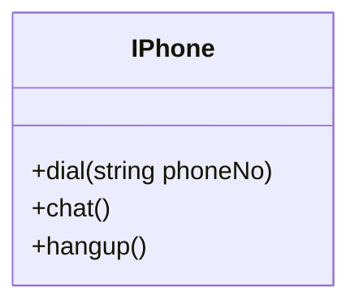

根据单一职责改进（IPhone接口包括协议管理dial，hangup和数据传送chat两个职责）

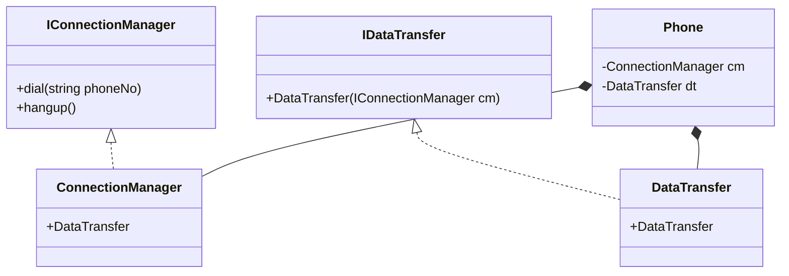

​	这个类图看上去优点复杂了，虽然完全满足单一职责原则，但是Phone类要把ConnectionManager和DataTransfer组合在一起才能使用，组合是一种强耦合关系，这样的强耦合还不如使用接口的实现方式，而且还增加了类的复杂性，多了两个类，因此再进行改进

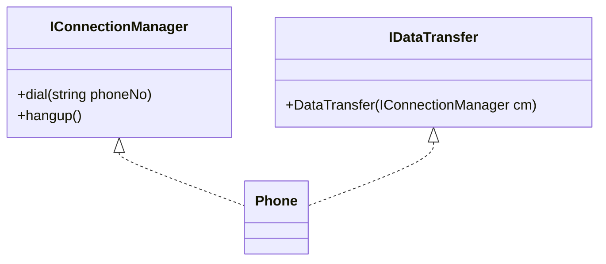

​	这样的设计才是完美的，一个类实现了两个接口，把两个职责融合在一个类中，虽然有两个原因引起变化了，但是我们是面向接口编程，对外公布的是接口而不是实现类。而且如果真要实现单一职责，就得使用上面的组合模式了，这会使得类间耦合过重，类的数量增加等问题，人为地增加了设计的复杂性

#### 优点

* 类的复杂性降低，实现什么职责都有清晰明确的定义
* 可读性提高（复杂性降低，可读性也就提高了）
* 可维护性提高（可读性提高，也就更容易维护）
* 变更引起的风险降低（变更是必不可少的，如果接口的单一职责做得好，一个接口修改只对相应的实现类有影响，对其它的接口无影响，这对系统的扩展性，维护性都有很大的帮助）

#### 概述

对于接口，在设计的时候一定要做到单一，但是对于实现类就需要多方面考虑了，生搬硬套单一职责原则会引起类的剧增，给维护带来非常多的麻烦，而且过分细分类的职责也会人为地增加系统的复杂性。本来一个类可以实现的行为硬要拆分成两个类，再使用聚合或合成的方式耦合在一起，人为制造了系统的复杂性。所以，原则是死的，人是活的。

单一职责适用于接口，类，同样适用于方法，即一个方法尽可能做一件事，比如不应该把修改用户密码，修改用户信息，修改家庭地址都放在一个修改用户信息的方法里面，而应该将其拆分为修改密码，修改用户信息，修改家庭地址等三个方法

#### 最佳实践

**对于单一职责原则，接口一定要做到单一职责，类的设计尽量做到只有一个原因引起变化**

### ③ 里氏替换

#### 定义

**Liskov Substitution Principle[LSP]**

**第一种：如果对于每一个类型为S的对象o1，都有类型为T的对象o2，使得以T定义的所有程序P在所有的对象o1都代换成o2时，程序P的行为没有发生变化，那么类型S是类型T的子类型**

**第二种：所有引用基类的地方必须能透明地使用其子类的对象**

#### 案例

--

#### 优点

* 继承的优点
  * 代码共享，减少创建类的工作量，每个子类都拥有父类的方法和属性
  * 提高代码的重用性
  * 提高代码的可扩展性
  * 提高产品或项目的开放性

* 继承的缺点
  * 继承是侵入性的，只要继承，就必须拥有父类的所有非私有属性和方法，破坏封装性
  * 降低代码的灵活性，子类必须拥有父类的属性和方法，让子类多了些约束
  * 增强了耦合性，当父类的常量，变量和方法被修改时，需要考虑子类的修改，而且在缺乏规范的环境下，这种修改可能带来非常糟糕的结果（大段的代码需要重构）

* LSP优点

  * 保留继承的优点，同时减少继承带来的问题（继承的缺点）

  * 增强程序的健壮性，版本升级时也可以保持非常好的兼容性

#### 概述

里氏替换原则为良好的继承定义了一个规范，一句简单的定义包含了4层含义（即满足这4点才算是正确的使用了里氏替换原则）：

* 子类必须完全实现父类的方法

  我们在做系统设计时，经常会定义一个接口或抽象类，然后编码实现，调用类则直接传入接口或抽象类，其实这里已经使用了里氏替换原则

  > 在类中调用其它类时务必要使用父类或接口，如果不能使用父类或接口，则说明类的设计已经违背了LSP原则
  >
  > 如果子类不能完整地实现父类的方法，或者父类的某些方法在子类中已经发生畸变，则建议断开父子继承关系，采用依赖、关联，聚合、合成等关系代替继承

* 子类可以有自己的个性

  子类当然可以有自己的行为和外观，也就是方法和属性，那这里为什么要再提呢？是因为LSP原则可以正着用，但是不能反着用。在子类出现的地方，父类未必就可以胜任

  > 向下转型（downcast）是不安全的，从LSP原则来看，就是有子类出现的地方父类未必就可以出现

* 覆盖或实现父类的方法时输入参数可以被放大

  方法中输入的参数称为前置条件，大家做过Web Service开发就应该知道有一个契约优先的原则，也就是先定义出WSDL接口，制定好双方的开发协议，然后再各自实现。LSP原则也要求定制一个契约，就是父类或接口，这种设计方法也叫做Design by Contract(契约设计),契约制定了，也就同时制定了前置条件和后置条件，前置条件是你要让我执行，就必须满足我的条件；后置条件就是我执行完了需要反馈，标准是什么。

  ```php
  <?php
  
  declare(strict_types=1);
  
  class Super
  {
      protected string $name = 'Super';
  
      /**
       * @return string
       */
      public function getName(): string
      {
          return $this->name;
      }
  }
  
  class Sub extends Super
  {
      protected string $name = 'Sub';
  }
  
  class Father
  {
      protected string $name = 'Father';
  
      public function classMerge(Super $class)
      {
          echo $this->name . $class->getName();
      }
  }
  
  class Son extends Father
  {
      protected string $name = 'Son';
  
      public function classMerge(Sub $class)
      {
          echo $this->name . $class->getName();
      }
  }
  
  $father = new Father();
  // 父类可以出现的地方子类就可以出现？那把Super换成Sub
  $class = new Sub(); // 可以运行，但是会有子类与父类不兼容的警告，php7.4如此，php8或许完善了就报错了
  $father->classMerge($class);
  ```

  **所以LSP要求子类中方法的前置条件类型必须与父类中被覆写的方法的前置条件类型相同或更宽松，如在继承中子类重写父类属性或方法时得比父类的访问权限更宽松**

  > 父类出现的地方，引用子类，没有任何问题，就算是满足了LSP

  所以上面的代码中Father类中classMerge，前置条件为Super，Son类应该是Super或比Super更宽松（如Super的父类）；Father类中classMerge，前置条件为Sub,Son类就应该是Sub或比Sub更宽松（如Sub的父类）

* 覆写或实现父类的方法时输出结果可以被缩小

  ```php
  <?php
  
  declare(strict_types=1);
  
  class Super
  {
      protected string $name = 'Super';
  
      /**
       * @return string
       */
      public function getName(): string
      {
          return $this->name;
      }
  }
  
  class Sub extends Super
  {
      protected string $name = 'Sub';
  }
  
  class Father
  {
      protected string $name = 'Father';
  
      public function classMerge(Sub $class)
      {
          echo $this->name . $class->getName();
      }
  
      public function getMergeObject(Sub $class): Sub
      {
          return $class;
      }
  }
  
  class Son extends Father
  {
      protected string $name = 'Son';
  
      public function classMerge(Super $class)
      {
          echo $this->name . $class->getName();
      }
  
      public function getMergeObject(Super $class): Super
      {
          return $class;
      }
  }
  
  $father = new Father();
  // 父类可以出现的地方子类就可以出现？那把Super换成Sub
  $class = new Sub();
  // 产生致命错误，子类与父类返回值类型不兼容
  $mergeObject = $father->getMergeObject($class);
  
  var_dump($mergeObject);
  ```

  **所以LSP要求子类中方法的后置条件（返回值）类型必须与父类中被覆写的方法的后置条件类型相同或更小**

  所以上面的代码中Father类中getMergeObject，后置条件为Super，Son类应该是Super或比Super更小（如Super的子类）；Father类中getMergeObject，后置条件为Sub,Son类就应该是Sub或比Sub更小（如Sub的子类）

  > 采用里氏替换原则的目的就是增强程序的健壮性，版本升级时也可以保持非常好的兼容性,即使增加子类，原有的子类还可以继续运行。在实际项目中，每个子类对应不同的业务含义，使用父类作为参数，传递不同的子类完成不同的业务逻辑

#### 最佳实践

在项目中，采用里氏替换原则时，尽量避免子类的个性，一旦子类有个性，这个子类和父类之间的关系就很难调和了，把子类当作父类使用，子类的个性被抹杀；把子类单独作为一个业务而不通过父类来使用，则会让代码间的耦合关系变得扑朔迷离（缺乏类替换的标准）

### ④ 依赖倒置

#### 定义

**Dependence Inversion Principle[DIP]**

**抽象不应该依赖于细节，细节应该依赖于抽象，即应针对接口编程，而不是针对实现编程**

#### 案例

#### 优点

* 减少类间耦合
* 提高系统稳定性
* 降低并行开发引起的风险
* 提高代码的可读性和可维护性

#### 概述

依赖倒置包含3层含义

* 高层模块不应该依赖低层模块，两者都应该依赖其抽象
* 抽象不应该依赖细节
* 细节应该依赖抽象

依赖倒置在面向对象设计语言中的表现

* 模块间的依赖通过抽象发生，实现类之间不发生直接的依赖关系，其依赖关系是通过接口或抽象类产生的

* 接口或抽象类不依赖实现类

* 实现类依赖接口或抽象类

  > 依赖倒置的核心是面向接口编程OOD（Object-Oriented Design）,面向对象设计的精髓之一

利用反证法来分析依赖倒置的优点

**不使用依赖倒置也可以松耦合，提高系统稳定性，可维护性和可读性？**

didi派单原来只有C1驾驶员和奔驰车，现在新增C2驾驶员和宝马车

```php
<?php

declare(strict_types=1);

class Benz
{
    public function run()
    {
        echo '奔驰开始运行';
    }
}

class Bmw
{
    public function run()
    {
        echo '宝马开始运行';
    }
}

class C1Driver
{
    public function __construct(string $name)
    {
        $output = "司机{$name}
        驾照C1
        ";

        echo "<pre>$output</pre>";
    }

    public function drive(Benz $car)
    {
        $car->run();
    }
}

class C2Driver
{
    public function __construct(string $name)
    {
        $output = "司机{$name}
        驾照C2
        ";

        echo "<pre>$output</pre>";
    }

    public function drive(Benz $car)
    {
        $car->run();
    }
}

class DiDi
{
    public function order(C1Driver $driver, Benz $car)
    {
        $driver->drive($car);
    }
}

$didi = new DiDi();

// didi派C1驾驶员张三开奔驰出单
$driver = new C1Driver('张三');
$car = new Benz();
$didi->order($driver, $car);

// didi派C2驾驶员李四开宝马出单，发现不能正常派单，只能派C1驾驶员，只能派开奔驰
$driver = new C2Driver('李四');
$car = new Bmw();
$didi->order($driver, $car);
```

上述代码可以看出没有使用依赖倒转倒置司机类，汽车类和DiDi类之间是都是紧耦合，导致系统可维护性降低，可读性降低（奔驰和宝马两个相似的类却需要阅读两个文件），稳定性（固化的，健壮的才是稳定的）降低，仅仅增加了一个C2司机类和宝马车类，却需要修改C1司机类和DiDi类。可以看出上面反论题已经不成立了

> 设计是否具备稳定性，只需要适当地松松土，观察设计的蓝图是否可以茁壮成长就可以得出结论，稳定性较高的设计，在周围环境频繁变化的时候，依然可以做到我自岿然不动

**不使用依赖倒置，也可以降低并行开引起的风险？**

什么是并行开发的风险？并行开发最大的风险就是风险扩散，本来只是一段程序的错误或异常，逐步波及一个功能，一个模块，甚至到最后毁了整个项目。为什么并行开发就有这样的风险呢？一个团队，20个开发人员，个人负责不同的模块，如甲负责汽车类的建造，乙负责司机类的建造，在甲没有完成的情况下，乙是不能完全地编写代码的，更不要说单元测试了，在这种不使用依赖倒置原则的环境中，所有的开发工作都是单线程的，甲做完，乙再做，然后丙再继续，这在小型项目中（一个人完成所有代码）比较适用，但是对于大中型项目已经完全不能胜任了，一个项目是一个团队协作的结果，个人再牛也不能了解所有业务和技术，要协作就要并行开发，要并行开发就要解决模块之间的项目依赖关系，这就需要使用依赖倒置，所以不使用依赖倒置，会增加并行开发引起的风险

**使用依赖倒置对上路案例进行改进**

```php
<?php

declare(strict_types=1);

interface CarAble
{
    public function run();
}

interface DriverAble
{
    public function drive(CarAble $car);
}

class Benz implements CarAble
{
    public function run()
    {
        echo '奔驰开始运行<br>';
    }
}

class Bmw implements CarAble
{
    public function run()
    {
        echo '宝马开始运行<br>';
    }
}

class C1Driver implements DriverAble
{
    public function __construct(string $name)
    {
        $output = "司机{$name}
        驾照C1
        ";

        echo "<pre>$output</pre>";
    }

    public function drive(CarAble $car)
    {
        $car->run();
    }
}

class C2Driver implements DriverAble
{
    public function __construct(string $name)
    {
        $output = "司机{$name}
        驾照C2
        ";

        echo "<pre>$output</pre>";
    }

    public function drive(CarAble $car)
    {
        $car->run();
    }
}

class DiDi
{
    public function order(DriverAble $driver, CarAble $car)
    {
        $driver->drive($car);
    }
}

$didi = new DiDi();

// didi派C1驾驶员张三开奔驰出单
$driver = new C1Driver('张三');
$car = new Benz();
$didi->order($driver, $car);

// didi派C2驾驶员李四开宝马出单
$driver = new C2Driver('李四');
$car = new Bmw();
$didi->order($driver, $car);
```

> 我们再来思考依赖倒置原则对并行开发的影响，两个类之间有依赖关系，只要制定出两者之间的接口（或抽象类）就可以独立开发了，而且项目之间的单元测试也可以独立运行（根据抽象虚拟一个对象），而TDD（Test-Driven Development,测试驱动开发）开发模式就是依赖倒置原则的最高级应用。
>
> 两个相互依赖的对象可以分别进行开发，孤立地进行单元测试，进而保证并行开发的效率和质量，TDD开发的精髓不就在这里吗？测试驱动开发，先写好单元测试类，然后再写实现类，这对提高代码质量有非常大的帮助，特别适合研发类项目或项目成员整体水平比较低的情况
>
> 抽象是对实现的约束，对依赖着而言，也是一种契约，不仅仅约束自己，还同时约束自己与外部的关系，其目的是保证所有的细节不脱离契约的范畴，确保约束双方按照既定的契约（抽象）共同发展，只要抽象这根基线再，细节就脱离不了这个圈圈，始终让你的对象做到言必行，行必果

**依赖的三种写法**

依赖是可以传递的，A对象依赖B对象，B又依赖C，C又依赖D，生生不息，依赖不知，但是只要做到抽象依赖，即使是多层的依赖传递也无所畏惧

* 构造函数传递依赖对象

  在类中通过构造函数声明依赖对象，按照依赖注入的说法，这种方式叫做构造函数注入

  ```php
  <?php
  
  declare(strict_types=1);
  
  interface DriverAble
  {
      public function drive();
  }
  
  interface CarAble
  {
      public function run();
  }
  
  class C1Driver implements DriverAble
  {
      private CarAble $car;
  
      public function __construct(CarAble $car)
      {
          $this->car = $car;
      }
  
      public function drive()
      {
          $this->car->run();
      }
  }
  ```

* Setter方法传递依赖对象

  在抽象中设置Setter方法依赖关系，按照依赖注入的说法，这是Setter注入（常用的方式）

  ```php
  <?php
  
  declare(strict_types=1);
  
  interface DriverAble
  {
      public function setCar(CarAble $car): void;
  
      public function drive();
  }
  
  interface CarAble
  {
      public function run();
  }
  
  class C1Driver implements DriverAble
  {
      private CarAble $car;
  
      public function setCar(CarAble $car): void
      {
          $this->car = $car;
      }
  
      public function drive()
      {
          $this->car->run();
      }
  }
  ```

* 接口声明依赖注入

  在接口的方法中声明依赖对象，该方法也就接口注入

  ```php
  <?php
  
  declare(strict_types=1);
  
  interface DriverAble
  {
      public function drive(CarAble $car);
  }
  
  interface CarAble
  {
      public function run();
  }
  
  class C1Driver implements DriverAble
  {
      public function drive(CarAble $car)
      {
          $car->run();
      }
  }
  ```

#### 最佳实践

依赖倒置原则的本质事通过抽象（接口或抽象类）使各个类或模块的实现彼此独立，不互相影响，实现模块间的松耦合，在项目中需要遵循以下几个规则

* 每个类都有接口或抽象类，或者抽象类和接口都具备

  这是依赖倒置的基本要求，接口和抽象类都是抽象的，有了抽象才可能倒置

* 变量的表面类型尽量是接口或者抽象类

  > 定义变量必然有类型，一个变量可以有两种类型，表面类型和实际类型，表面类型是在定义时赋予的类型，实际类型时对象的类型

  很多书上说变量类型一定要是接口或者抽象类，这个有点绝对化了，比如一个工具类，xxxUtils一般是不需要接口或抽象类的。还有Java中要使用类的clone方法，就必须使用实现类（JDK提供的一个规范）

* 任何类都不应该从具体类派生

  如果一个项目处于开发状态，确实不应该有从具体类派生出子类的情况，但这也不是绝对的，因为人都是会犯错误的，有时设计缺陷是在所难免的，因此只要不超过两层的继承都是可以忍受的。特别是负责项目维护的同志，基本上可以不考虑这个规则，为社么？维护工作基本上都是进行扩展开发，修复行为，通过一个继承关系，覆写一个方法就可以修正一个很大的Bug，何必去继承最高的基类呢？（当然这种情况尽量发生在不甚了解父类或者无法获得父类代码的情况下）

* 尽量不要覆写基类的方法

  如果基类是一个抽象类，而且这个方法已经实现了，子类尽量不要覆写。类间的依赖是抽象，覆写了抽象方法，对依赖的稳定性会产生一定的影响

* 结合里氏替换原则使用

  里氏替换原则，父类出现的地方子类就能出现，在结合依赖倒置，我们可以得出一个通俗的规则：接口负责定义public属性和方法，并且声明与其它对象的依赖关系，抽象类负责公共构造部分的实现，实现类准确的实现业务业务逻辑，同时在适当的时候对父类进行细化

依赖倒置的优点在小型项目中很难体现出来，但是在一个大中型项目中，采用依赖倒置则有非常多的优点，特别是规避一些非技术因素引起的问题。项目越大，需求变化的概率也越大，通过采用依赖倒置原则设计的接口或抽象类对实现类进行约束，可以减少需求变化引起的工作量剧增的情况，人员变动在大中型项目中也时常存在的，如果设计优良、代码结构清晰，人员变化对项目的影响成本基本为0。大中型项目的维护周期一般很长，采用依赖倒置原则可以让维护人员轻松的扩展和维护

> 依赖倒置是6个设计原则中最难以实现的原则，它是实现开闭原则的重要途径，依赖倒置原则没有实现，就别想对外开放，对修改关闭。在项目中，大家只要记住：面向接口编程就基本抓住了依赖倒置原则的核心

### ⑤ 接口隔离

#### 定义

**Interface Segregation Principle[ISP]**

**第一种：客户端不应该依赖它不需要的接口**

**第二种：类间的依赖关系应该建立在最小的接口上**

> 接口分为两种
>
> 实例接口：声明一个类，然后用new关键字产生一个实例，它是对一个类型的事物的描述，这是一种接口，比如：定义Person类，Person zhangsan = new Person()，zhangsan这个实例要遵从的标准就是Person这个类，Person类就是zhangsan的接口
>
> 类接口：使用interface关键字定义的接口

把上面的两个定义概括为一句话：建立单一接口，不要建立臃肿庞大的接口，更通俗一点就是接口尽量细化，同时接口中的方法尽量少。是不是觉得和单一职责有点像？接口隔离原则和单一职责原则的审视角度是不同的，单一职责要求的是类和接口职责单一，注重的是职责，这是业务逻辑上的划分，而接口隔离原则要求接口的方法尽量少，按所需模块划分。例如一个接口的职责可能包含10个方法，这10个方法都在一个接口中，并且提供给多个模块访问，各个模块按照规定的权限来访问，在系统外通过文档约束不使用的方法不要访问，按照单一职责原则是允许的，因为它们功能职责是一样的，按照接口隔离原则是不允许的，因为它要求**尽量使用多个专门的接口**，所需模块不同。专门的接口指的是什么？就是指提供给每个模块的都应该是单一接口，提供给几个模块就应该有几个接口，而不是建立一个庞大臃肿的接口，容纳所有客户端访问

某开源后台管理系统分为正式版和沙箱版，正式版用户可以对数据增删改查，沙箱版用户只能进行创建和读取操作

单一职责

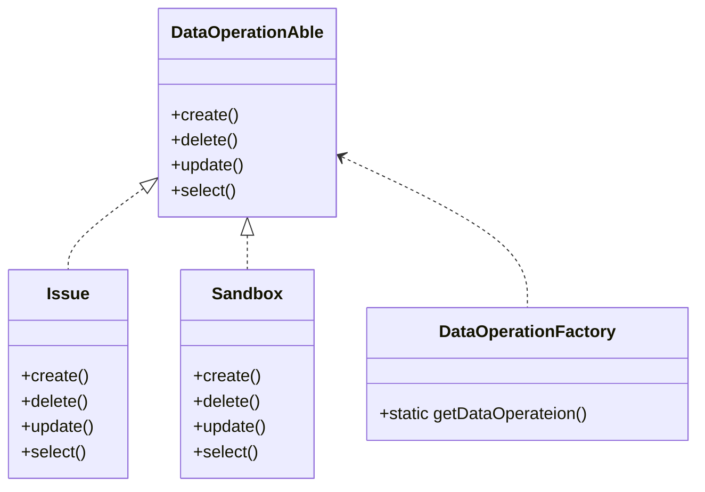

```php
<?php

declare(strict_types=1);

interface DataOperationAble
{
    public function create();

    public function delete();

    public function update();

    public function select();
}

class Issue implements DataOperationAble
{
    public function create()
    {
        echo '数据创建中<br>';
    }

    public function delete()
    {
        echo '数据删除中<br>';
    }

    public function select()
    {
        echo '数据读取中<br>';
    }

    public function update()
    {
        echo '数据更新中<br>';
    }
}

class Sandbox implements DataOperationAble
{
    public function create()
    {
        echo '数据创建中<br>';
    }

    public function delete()
    {
        echo '对不起，沙箱版暂不支持删除数据！<br>';
    }

    public function select()
    {
        echo '数据读取中<br>';
    }

    public function update()
    {
        echo '数据更新中<br>';
    }
}

class DataOperationFactory
{
    public static function getDataOperation(string $env): DataOperationAble
    {
        $env = strtolower($env);

        switch ($env) {
            case 'issue':
                $dataOperation = new Issue();
            break;
            case 'sandbox':
                $dataOperation = new Sandbox();
            break;
            default:
                throw new InvalidArgumentException('Param is invalid.');
        }

        return $dataOperation;
    }
}

$env = 'sandbox';
$dataOperation = DataOperationFactory::getDataOperation($env);
$dataOperation->create();
$dataOperation->delete();
$dataOperation->update();
$dataOperation->select();
```

接口隔离

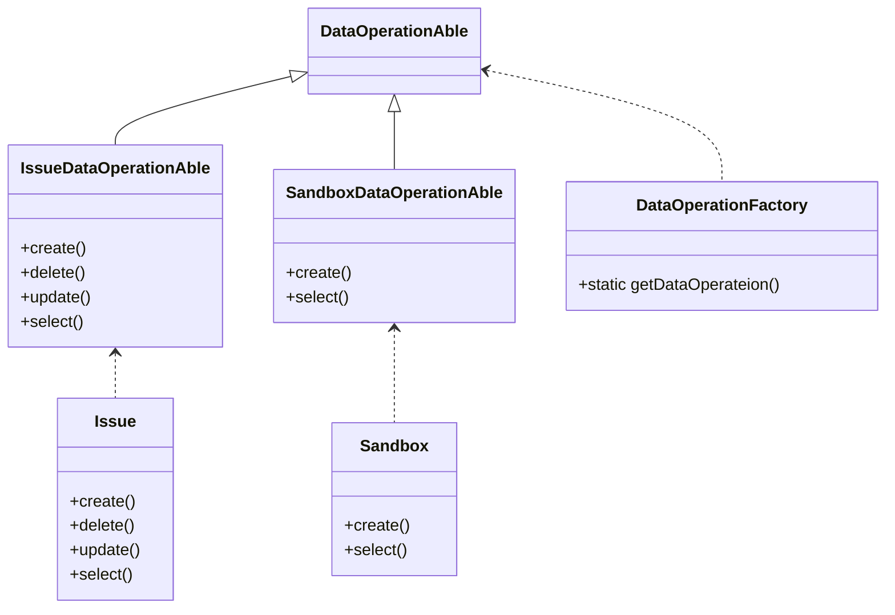

```php
<?php

declare(strict_types=1);

//标记接口，标记为数据操作类
interface DataOperationAble
{

}

interface IssueDataOperationAble extends DataOperationAble
{
    public function create();

    public function delete();

    public function update();

    public function select();
}

interface SandboxDataOperationAble extends DataOperationAble
{
    public function create();

    public function select();
}

class Issue implements IssueDataOperationAble
{
    public function create()
    {
        echo '数据创建中<br>';
    }

    public function delete()
    {
        echo '数据删除中<br>';
    }

    public function select()
    {
        echo '数据读取中<br>';
    }

    public function update()
    {
        echo '数据更新中<br>';
    }
}

class Sandbox implements SandboxDataOperationAble
{
    public function create()
    {
        echo '数据创建中<br>';
    }

    public function select()
    {
        echo '数据读取中<br>';
    }

    public function __call($name, $arguments)
    {
        echo "对不起，沙箱版暂不支持{$name}<br>";
    }
}

class DataOperationFactory
{
    public static function getDataOperation(string $env): DataOperationAble
    {
        $env = strtolower($env);

        switch ($env) {
            case 'issue':
                $dataOperation = new Issue();
            break;
            case 'sandbox':
                $dataOperation = new Sandbox();
            break;
            default:
                throw new InvalidArgumentException('Param is invalid.');
        }

        return $dataOperation;
    }
}

$env = 'sandbox';
$dataOperation = DataOperationFactory::getDataOperation($env);
$dataOperation->create();
$dataOperation->delete();
$dataOperation->update();
$dataOperation->select();
```

#### 案例

上面接口隔离案例

#### 优点

#### 概述

接口隔离原则是对接口进行规范约束，其包含以下4层含义：

* 接口要尽量小

  这是接口隔离的核心定义，不出现臃肿的接口，但是小是有限度的，首先就是不能违背单一职责原则。比如上面单一职责案例，本来职责是数据操作，因为不同的环境（正式版和沙箱版）数据操作不一样，我们就去把单一的数据操作职责拆分成数据添加职责，数据删除职责，数据修改职责，数据查询职责4个职责？从业务上将，数据操作已经是最小的业务单位了，再细分下去就是对业务的拆分了。从业务层次来看，这样的设计是失败的，接口隔离要我们拆分，单一职责又不让拆，听谁的？答案是：**根据接口隔离原则拆分接口时，首先必须满足单一职责原则**

* 接口要高内聚

  什么是高内聚？高内聚就是提高接口、类、模块的处理能力，减少对外的交互。具体到接口隔离原则就是：要求接口中尽量少公布public方法，接口是对外的承诺，承诺越少对系统的开发越有利，变更的风险也就越少，同时也利于较低成本

* 定制服务

  一个系统或系统内的模块之间必然有耦合，会有耦合就要有互相访问的接口（并不一定是Interface，也可能是一个类或单纯的数据交换），我们在设计时就需要为各个访问者（即客户端）定制服务，什么是定制服务？就是单独为一个个体提高优良的服务（只提供访问者需要的方法）

* 接口设计是有限度的

  接口的设计粒度越小，系统越灵活，这是不争的事实。但是，灵活的同时也带来了结构的复杂化，开发难度增加，可维护性降低，所以接口设计一定要适度，这个度就需要根据经验和常识判断了，没有一个固化或可测量的标准

#### 最佳实践

接口隔离原则是对接口的定义，同时也是对类的定义，接口和类尽量使用原子接口或原子类来组装，但是这个原子该怎么划分是设计模式中的一大难题，在实践中可根据以下几个规则来衡量：

* 一个接口只服务于一个子模块或业务逻辑
* 通过业务逻辑压缩接口中的public方法，接口时常去回顾，尽量让接口达到满身筋骨肉，而不是肥嘟嘟的一大堆方法
* 已经被污染了的接口，尽量去修改，若变更的风险比较大，则采用适配器模式进行转化处理
* 了解环境，拒绝盲从。每个项目或产品都有特定的环境因素，别看大师是这样做的就找抄。千万别，环境不同，接口拆分的标准就不同。深入了解业务逻辑，最好的接口设计就出自你的手中

### ⑥ 迪米特

#### 定义

**Demeter Principle[DP]**

**迪米特法则也称为最少知识原则，一个对象应该对其它对象有最少的了解**

> 迪米特原则通俗的讲：一个类应该对自己需要耦合或调用的类知道得最少，你（被耦合或调用的类）的内部是如何复杂都和我没关系，那是你的事情，我就知道你提供的这么多public方法，我就调用这么多，其他的我一概不关心

#### 案例

#### 优点

* 类间解耦
* 提高系统灵活性，可维护性和稳定性

#### 概述

迪米特法则对类的低耦合提出了明确的要求，其包含以下4层含义：

* 只和朋友交流

  迪米特法则还有一个英文解释是：Only talk to your immediate friends（只与直接的朋友通信）。什么叫做直接的朋友呢？每个对象都必然会与其它对象有耦合的关系，两个对象之间的耦合就会成为朋友关系，这种关系的类型有很多：依赖，关联，聚合，合成，泛化

  什么叫做与朋友直接交流？案例：腾讯网友口中的口口相传（行政部通过WXG告诉CSIG你们部门要裁50%）

  ```mermaid
  classDiagram
  	Administration ..> Wxg
  	Administration ..> Csig
  	Wxg ..> Csig
  
      class Administration {
         +notify(Wxg wxg, string $message)
      }
      class Wxg {
         +turn(Csig csig, string message)
      }
      class Csig {
         -static message
         +setMessage()
         +getMessage()
      }
  ```

  

  ```php
  <?php
  
  declare(strict_types=1);
  
  class Csig
  {
      private static string $message;
  
      public function getMessage()
      {
          echo static::$message;
      }
  
      /**
       * @param string $message
       */
      public function setMessage(string $message): void
      {
          static::$message = $message;
      }
  }
  
  class Wxg
  {
      public function turn(Csig $csig, string $message)
      {
          $message = '你们部门要裁80%，快run！';
          $csig->setMessage($message);
      }
  }
  
  class Administration
  {
      public function notify(Wxg $wxg, string $message)
      {
          $csig = new Csig();
          $wxg->turn($csig, $message);
      }
  }
  
  $administration = new Administration();
  $wxg = new Wxg();
  $administration->notify($wxg, 'Csig部门要裁50%，让他们准备一下吧！');
  $csig = new Csig();
  $csig->getMessage();
  ```

  上面的代码有什么问题呢？Administration类有几个朋友类？它仅有一个朋友类--Wxg，虽然Administration对Csig产生了依赖，但他不是。

  > 朋友类的定义：出现在成员变量，方法的输入输出参数中的类称为成员朋友类，而出现在方法体内部的类不属于朋友类

  迪米特法则告诉我们只和朋友类交流，Administration类却和陌生类Csig有了交流，这样会破坏Administration的健壮性。方法是一个类的行为，类竟然不知道自己的行为与其他类产生依赖关系，这是不允许的，严重违反了迪米特法则。

  纵观现实，我们已经明确了Administration只需要发布通知给Wxg，然后由他们转发给Csig，那我根本不需要知道Csig

  对上述案例按照迪米特做出修改

  

  ```mermaid
  classDiagram
  	Administration ..> Wxg
  	Wxg --> Csig
  
      class Administration {
         +notify(Wxg wxg, string $message)
      }
      class Wxg {
         -Csig csig
         +turn(string message)
      }
      class Csig {
         -static message
         +setMessage()
         +getMessage()
      }
  ```

  

  ```php
  <?php
  
  declare(strict_types=1);
  
  class Csig
  {
      private static string $message;
  
      public function getMessage()
      {
          echo static::$message;
      }
  
      /**
       * @param string $message
       */
      public function setMessage(string $message): void
      {
          static::$message = $message;
      }
  }
  
  class Wxg
  {
      private Csig $csig;
  
      public function turn(string $message)
      {
          $message = '你们部门要裁80%，快run！';
          $this->csig = new Csig();
          $this->csig->setMessage($message);
      }
  }
  
  class Administration
  {
      public function notify(Wxg $wxg, string $message)
      {
          $wxg->turn($message);
      }
  }
  
  $administration = new Administration();
  $wxg = new Wxg();
  $administration->notify($wxg, 'Csig部门要裁50%，让他们准备一下吧！');
  $csig = new Csig();
  $csig->getMessage();
  ```

  对程序做出了修改，避开了Administration对Csig的访问，降低了系统间的耦合，提高了系统的健壮性

  >一个类只和朋友交流，不与陌生类交流，不要出现getA().getB().getC().getD()这种情况（在一种极端的情况下允许出现这种访问，即每一个.号后面的返回类型都相同），类与类之间的关系是建立在类间的，而不是方法间，因此一个方法尽量不引入一个类中不存在的对象（语言提供的类除外）

* 朋友之间也是有距离的

  距离产生美，即使是朋友类之间也不能无话不说，无所不知

  案例：我们在安装软件的时候，经常会有一个导向动作，第一步是确认是否安装，第二步是确认License是否安全，再然后是一些自定义设置等，这是一个典型的顺序执行动作，具体到程序就是：调用一个或多个类，先执行第一个方法，然后是第二个方法，根据返回结果再来看是否可以调用第三个方法，或者第四个方法，等等

  案例：安装某软件执行3步且都成功之后安装成功，否则安装失败

  ```mermaid
  classDiagram
  	InstallSoftware ..> Wizard
  
      class InstallSoftware {
         +installWizard(Wizard wizard)
      }
      class Wizard {
         +first()
         +second()
         +third()
         +fail()
         +success()
      }
  ```

  ```php
  <?php
  
  declare(strict_types=1);
  
  class Wizard
  {
      public function __construct()
      {
          echo '安装开始-------------------------------------<br>';
      }
  
      public function first(): int
      {
          $result = rand(0, 1);
          $message = $result ? '成功' : '失败';
          echo "执行第一个方法{$message}<br>";
  
          return $result;
      }
  
      public function second(): int
      {
          $result = rand(0, 1);
          $message = $result ? '成功' : '失败';
          echo "执行第二个方法{$message}<br>";
  
          return $result;
      }
  
      public function third(): int
      {
          $result = rand(0, 1);
          $message = $result ? '成功' : '失败';
          echo "执行第三个方法{$message}<br>";
  
          return $result;
      }
  
      public function fail()
      {
          echo '安装失败-------------------------------------<br>';
      }
  
      public function success()
      {
          echo '安装成功-------------------------------------<br>';
      }
  }
  
  class InstallSoftware
  {
      public function installWizard(Wizard $wizard)
      {
          if ($wizard->first() === 1) {
              if ($wizard->second() === 1) {
                  if ($wizard->third() === 1) {
                      $wizard->success();
                  } else {
                      $wizard->fail();
                  }
              } else {
                  $wizard->fail();
              }
          } else {
              $wizard->fail();
          }
      }
  }
  
  $installSoftware = new InstallSoftware();
  $wizard = new Wizard();
  $installSoftware->installWizard($wizard);
  ```

  代码上线后，review代码的时候发现代码不规范，三个步骤代表的是用户是否进行下一步，应该返回布尔类型，那就改吧？改了Wizard，还需要修改InstallSoftware。造成这种情况是因为Wizard类把太多的方法暴漏给InstallSoftware类，两者的朋友关系太亲密了，耦合关系变得异常牢固。当修改Wizard类时，就必须修改InstallSoftware类，从而把修改变更的风险扩散开了。这样的耦合时极度不合适的，因此需要对系统进行重构

  ```mermaid
  classDiagram
  	InstallSoftware ..> Wizard
  
      class InstallSoftware {
         +installWizard(Wizard wizard)
      }
      class Wizard {
         +first()
         +second()
         +third()
         +fail()
         +success()
         +installWizard()
      }
  ```

  ```php
  <?php
  
  declare(strict_types=1);
  
  class Wizard
  {
      public function __construct()
      {
          echo '安装开始-------------------------------------<br>';
      }
  
      private function first(): bool
      {
          $result = (bool)rand(0, 1);
          $message = $result ? '成功' : '失败';
          echo "执行第一个方法{$message}<br>";
  
          return $result;
      }
  
      private function second(): bool
      {
          $result = (bool)rand(0, 1);
          $message = $result ? '成功' : '失败';
          echo "执行第二个方法{$message}<br>";
  
          return $result;
      }
  
      private function third(): bool
      {
          $result = (bool)rand(0, 1);
          $message = $result ? '成功' : '失败';
          echo "执行第三个方法{$message}<br>";
  
          return $result;
      }
  
      private function fail()
      {
          echo '安装失败-------------------------------------<br>';
      }
  
      private function success()
      {
          echo '安装成功-------------------------------------<br>';
      }
  
      public function installWizard()
      {
          if ($this->first()) {
              if ($this->second()) {
                  if ($this->third()) {
                      $this->success();
                  } else {
                      $this->fail();
                  }
              } else {
                  $this->fail();
              }
          } else {
              $this->fail();
          }
      }
  }
  
  class InstallSoftware
  {
      public function installWizard(Wizard $wizard)
      {
          $wizard->installWizard();
      }
  }
  
  $installSoftware = new InstallSoftware();
  $wizard = new Wizard();
  $installSoftware->installWizard($wizard);
  ```

  通过重构后，类间的耦合关系变弱了，结构也清晰了，变更引起的风险也变小了

  一个类公开的public属性或方法越多，修改时涉及的面也就越大，变更引起的风险扩散也就越大。因此，为了保持朋友类间的距离，在设计时需要反复衡量：是否还可以再减少public方法和属性，是否可以修改为private，Java package-private（包类型，在类、方法、变量前不加访问权限，则默认为包类型），protected等访问权限，是否可以加上final关键字等

  > 迪米特法则要求类羞涩一点，尽量不要对外公布太多的public方法和非静态的public变量，尽量内敛，多使用private、Java package-private、protected等访问权限

* 是自己的就是自己的

  在实际应用中经常会出现这样一个方法：放在本来中也可以，放在其它类中也没有错，那怎么去衡量呢？你可以检查这样一个原则：**如果一个方法放在本类中，既不增加类间关系，也对本类不产生负面影响，那就放在本类中**

#### 最佳实践

迪米特法则的核心观念就是类间解耦，弱耦合，只有弱耦合了以后，类的复用率才可以提高。其要求的结果就是产生了大量的中转或跳转类，导致系统的复杂性提高，同时也为维护带来了困难。所以在采用迪米特法则的时候需要反复权衡，既做到让结构清晰，又做到高内聚低耦合。

根据著名的六度分隔理论（任何两个素不相识的人中间最多只隔着6个人），调用者类和被调用者类之间最多有六次传递？在实际应用中，如果一个类跳转两次以上才能访问到另一个类，就需要想办法进行重构了，为什么是两次以上呢？因为一个系统的成功不仅仅是一个标准或是原则就能够决定的，有非常多的外在因素决定，跳转次数越多，系统越复杂，维护就越困难，所以只要不超过两次都是可以忍受的，这需要具体问题具体分析

迪米特法则要求类间解耦，但解耦是有限度的，除非是计算机的最小单元（二进制的0和1）那才是完全解耦，在实际项目中，需要适度考虑这个原则，别为了套用原则而做项目。原则只是供参考，违背了这个原则，项目也未必会失败，这就需要大家在采用原则的时候反复度量，不遵循是不对的，严格执行是过犹不及

### ⑦ 合成复用

#### 定义

**Composite Reuse Principle[CRP]**

**在软件复用时，尽量使用组合或聚合等关联关系来实现，其次再考虑继承**

> 如果使用继承，必须严格遵循里氏替换原则，合成复用原则和里氏替换原则是相辅相成的，两者都是开闭原则的实现规范

#### 案例

某软件公司DB采用的是MySQL，DBUtil里面封装了数据库连接方法，模型为了复用数据库连接方法，使用了继承

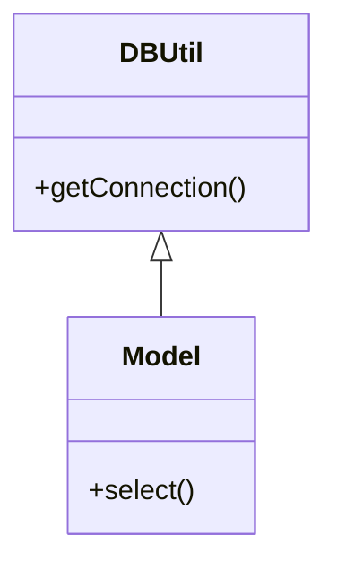

现在需要将MySQL替换为Oracle,需要修改DBUtil的连接代码，或者在Model重写连接代码，都违背了开闭原则，所以需要进行改进

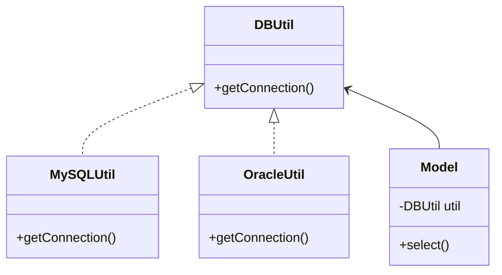

经过改进之后，Model可以复用DBUtil的代码，只需要在运行时指定具体的DBUtil实现类即可，提高了系统灵活性和稳定性

#### 优点

* 保证了类的封装性
* 降低类间耦合
* 提高系统灵活性和稳定性

#### 概述

通常类的复用分为继承复用和合成复用两种，继承复用虽然有简单和易实现的优点，但它也存在以下缺点

* 继承破坏类的封装性。因为继承会将父类的实现细节暴漏给子类，父类对子类是透明的，所以这种复用又被称为白箱复用
* 子类与父类耦合度高。父类的的实现有任何变更都会波及子类，不利于扩展和维护
* 限制了复用的灵活性。从父类继承而来的实现是静态的，在编译时已经定义，所以在运行时不可能发生变化

采用组合或聚合复用时，可以将已有对象纳入到新的对象中，使之称为新对象的一部分，新对象可以调用已有对象的功能，有以下优点

* 维持了类的封装性。因为成分性对象的内部细节是新对象看不见的，所以这种复用又称为黑箱复用
* 新旧类之间的耦合度降低。这种复用所需的依赖较少，新对象存取成分对象的唯一方法是通过成分对象的接口
* 复用的灵活性提高。这种复用可以在运行时动态进行，新对象可以动态地引用与成分对象类型相同的对象

#### 最佳实践

虽然里氏替换原则对良好的继承定义了规范，但是继承毕竟是类间耦合最高的，耦合过高不利于系统的稳定和扩展，因此我们应该尽量考虑是否可以通过耦合较低的组合，组合，关联来替代继承（泛化），最终实现代码复用的目的

## 3.4 设计模式分类

### 3.4.1 创建型设计模式

#### ① 简单工厂

#### ② 工厂方法

#### ③ 抽象工厂

#### ④ 单例

#### ⑤ 原型

#### ⑥ 对象池

#### ⑦ 建造者

### 3.4.2 结构型设计模式

#### ① 适配器

#### ② 桥接

#### ③ 过滤器

#### ④ 组合

#### ⑤ 装饰器

#### ⑥ 外观

#### ⑦ 享元

#### ⑧ 代理

### 3.4.3 行为型设计模式

#### ① 策略

#### ② 空对象

#### ③ 访问者

#### ④ 状态

#### ⑤ 责任链

#### ⑥ 中介者

#### ⑦ 备忘录

#### ⑧ 观察者

#### ⑨ 命令

#### ⑩ 解释器

#### ⑪ 迭代器

#### ⑫ 解释器


# 四、操作系统


# 五、计算机网络


# 六、Leetcode


# 七、Linux


# 八、关系型数据库


# 九、非关系型数据库


# 十、PHP


#  十一、服务器


# 十二、消息队列


# 十三、搜索引擎


# 十四、容器技术


